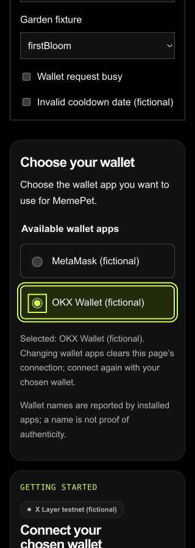
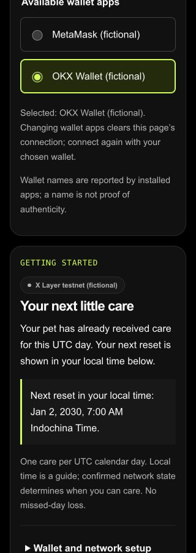
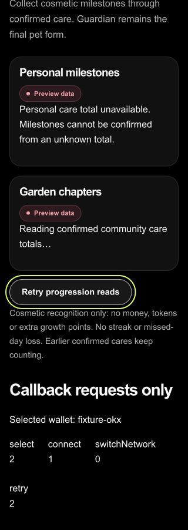
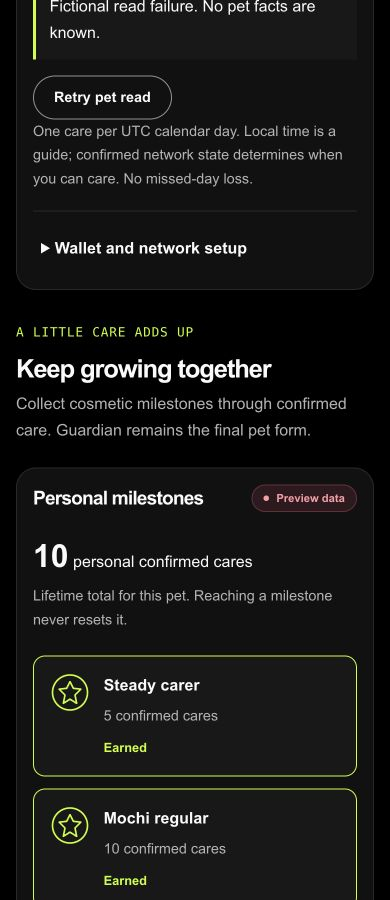
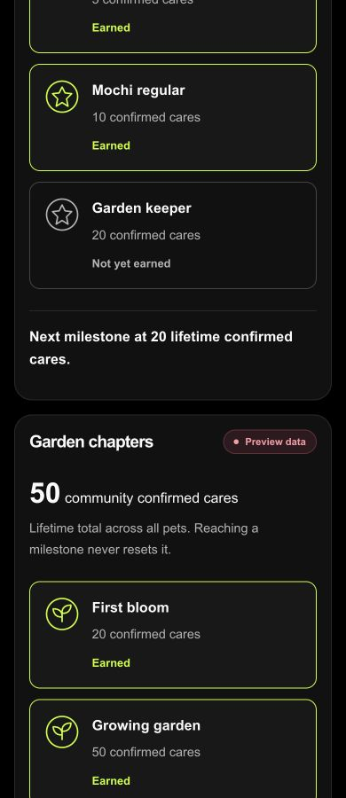
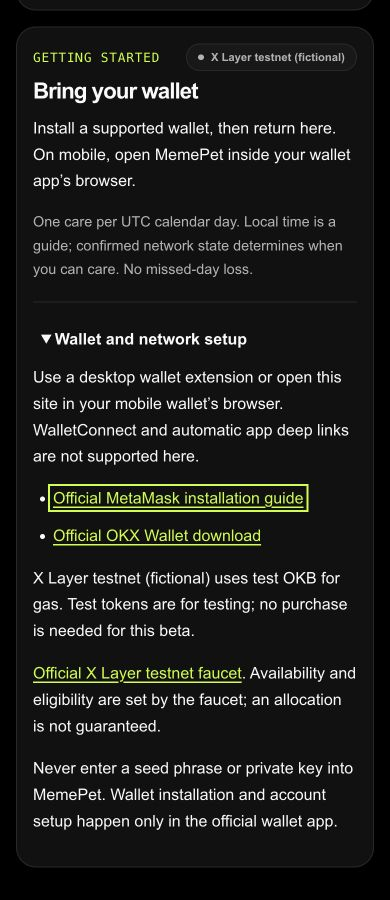
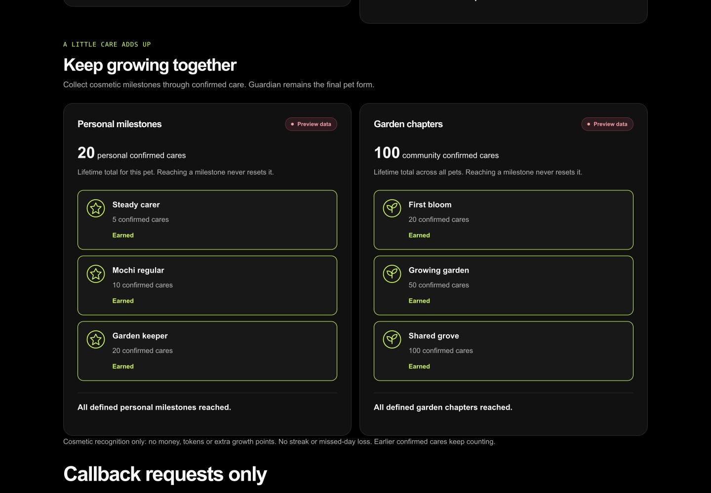

# B1 onboarding and continued progression — 2 October 2026

## Source and delivery

- Branch: `feat/beta-onboarding-progression`; PR: https://github.com/Chi944/MemePet/pull/90.
- Initial clean start: `16da0bae3ef54719819222a5550954be217fb16f` after #81/#82. No prior B1 branch or uncommitted work existed. After the interruption, fetched again and safely fast-forwarded the still-clean branch.
- Final base: **`48ee4c7d09b59b229d5046c887927398e3be47ab`**, reviewed main through #89, including #81 provider selection and #85 preview/retry work.
- Checked component source: **`4f621577bde7871d2bc269b5ab83ff546872dff3`**. Browser checks used this component content before commit. Subsequent handoff changes add evidence and ignore generated `.next` files in the standalone preview watcher. Final PR head is recorded in its description.
- Only `src/components/onboarding/**`, `src/components/progression/**` and this QA folder changed. No shared types/fixtures/hooks/routes/global styles/configuration/packages or earlier pet components changed. Free tools and native SVG badges only.

## Components

`WalletChooser` consumes `WalletChooserProps`. Native radios use opaque provider IDs and controlled selection, with no automatic choice even for one wallet. Busy choices are disabled. Empty/disappearing choices are explained. Provider names render only as text; no injected icons or discovery. Selecting does not claim a connection.

`OnboardingPanel` consumes `OnboardingPanelProps` and covers all nine supplied states. Only explicit connect, switch and unavailable-read retry callbacks are emitted. Adoption/care stay in the existing primary action area. Loading/unknown state never becomes no-pet or ready. Cooldown formats the supplied explicit ISO instant in the browser timezone after hydration, retains the UTC-day rule, rejects invalid/ambiguous dates and never uses the local clock to enable care. The hydration snapshot produces deterministic server text rather than a server-timezone label. No timers, storage or network requests.

Setup includes mobile wallet-browser guidance, verified official wallet links, displayed network/gas symbol, X Layer testnet faucet guidance with no allocation promise, and no seed/key request. Local Anvil is not called mainnet. WalletConnect/deep links are explicitly unsupported.

`ProgressionPanel` consumes `ProgressionPanelProps`: personal 5/10/20 and community 20/50/100 definitions come from the supplied mapped inputs. Counts are preserved above targets; `reached` and `nextTarget` are authoritative. No component-owned unlocking formula. Loading and unavailable totals show no zero or badges; ready community data can appear independently of unknown personal data. One explicit retry callback. Recognition is cosmetic, Guardian stays final, and no missed-day loss, extra growth, monetary reward or fabricated history is introduced.

## Lead integration requested explicitly

1. Replace the temporary lead `WalletProviderPicker` presentation with `WalletChooser`. Map the existing hook's `selectionBusy` to `busy`, `selectWallet` to `onSelect`; provider discovery, selection-required guards, connection prompts and session invalidation stay in the lead hook.
2. Supply `OnboardingPanel` and `ProgressionPanel` from `mapBetaPanelState` using one current hook render/session. Connect/switch callbacks remain explicit; unavailable pet retry should use guarded `retryPet`. Progression retry should retry only the currently failed reads. Do not infer missing personal reads as no-pet or zero.
3. Extend the lead-owned `/dev/beta` with these reviewed components and the existing beta fixtures/callback counters, preserving the production 404 gate. B1 does not edit that route. The local-only harness below permits reproducible review now; no new shared input is required.
4. Adoption/care remain the existing primary actions. No cooldown retry button is shown: the existing `retryPet` accepts failed-read state only. Invalid time remains explanatory and does not enable care.

Live route wiring, new provider acceptance and production appearance are NOT RUN by this component lane. Marking this PR ready means component handoff ready, not released beta or final wallet acceptance. Codex reviews/integrates/merges; this lane did not merge or manually deploy.

## Exact checks personally run

Node **24.19.0**, npm **11.19.0**, Next.js **16.3.8**; existing pinned dependencies installed with `npm ci` (lockfile unchanged).

| Command | Actual result |
|---|---|
| `npm ci` | PASS; 457 packages, audit reported zero vulnerabilities. npm reported two uncovered install-script declarations and the existing ESLint deprecation; no approval/package-policy change made. |
| `npm test -- src/components/onboarding src/components/progression` | PASS, 51 cases before two additional stale-state cases; final full suite below includes all 53 B1 cases. |
| `npm test` | PASS, **736 tests / 54 files** on final component/tests content. |
| `npm run typecheck` | PASS |
| `npm run lint` | PASS, zero errors; one existing ShareImage native-img warning. |
| `npm run build` | PASS. Run after final component behavior changes; only two additional tests and evidence followed. |
| `node --test docs/qa/counter-check.regression.mjs docs/qa/rpc-recovery.regression.mjs` | PASS, **22 tests**; loopback/network permission used. |
| `git diff --check` | PASS |
| Local contract tests; Playwright simulated-wallet and dev-preview suites | NOT RUN locally. Final-head PR CI is recorded separately; those existing preview suites do not cover the new B1 harness or prove real wallets. |

Tests cover both provider options, zero/one/two providers, controlled selection, busy/vanished choices, plain-text names, all onboarding states and exact callbacks, no duplicated primary action, ISO/local date handling and server placeholder, invalid/stale/past dates, official link destinations, local Anvil wording, unknown versus zero, independent personal/community readiness, 4/5/9/10/19/20/27 personal boundaries and 19/20/49/50/99/100/137 garden boundaries, authoritative supplied flags/targets, and removal of stale earned badges after a new loading/failed scope.

### Failures retained

The first onboarding test run had **28 pass / 4 fail**: three callbacks received React's click event despite their no-argument contract, and the Intl constructor mock used an arrow function. Explicit callback wrappers and a constructible test mock fixed them; no assertion was removed. The first lint run rejected synchronous setState in the date-formatting effect. Replaced it with React's hydration snapshot, with no lint override. Subsequent checks above pass. Vite's existing future-config-loader warning remains a warning.

## Genuine browser observations — FICTIONAL COMPONENT PREVIEW

Date: **2 October 2026**, roughly **15:30–15:37 UTC / 23:30–23:37 Singapore**. Codex in-app browser on macOS. Runtime:
`http://127.0.0.1:3421/docs/qa/beta/kym/preview.html`.

This is the actual new React components and shared fixtures, served by the installed Vite dependency, with existing global CSS and an explicitly set Arial/monospace fallback. It is **not** the Next.js live route, a wallet simulation, or production. All controls are fictional; no wallet object, RPC, storage, signature or model is used. Separate selectors can intentionally create inconsistent fixture combinations and do not model a complete live session.

| Width / height | Observed behavior |
|---|---|
| 320 × 900 | Space selected fictional MetaMask, Right Arrow selected fictional OKX; visible focus surrounded the full selected row. Tab reached Connect, Enter incremented only the fictional connect counter. Busy disabled both radios. Local reset wrapped visibly as **Jan 2, 2030, 7:00 AM Indochina Time** for `2030-01-02T00:00:00.000Z`; UTC-day wording remained. Invalid-date control replaced the time with unavailable copy. Unknown personal/loading community displayed no totals/badges; retry focus was visible. |
| 390 × 900 | Personal 10 showed two earned badges and next absolute target 20; community 50 showed two earned chapters and next target 100. Text and cards wrapped. All onboarding fixture states were inspected; loading/adopt/ready did not add a new action button. Setup summary toggled with Space/Enter; Tab focused the official MetaMask link with visible outline. No external link was activated. |
| 1440 × 1000 | Both milestone cards fit side by side. All-reached preserved personal 20 and community 100 and marked all six earned; Guardian-final/cosmetic wording remained. Zero personal and pre-bloom community 19 showed no earned badges, with targets 5 and 20. No-wallet guidance was visible; a single wallet remained unselected. Explicit fictional switch callback incremented once. |

At each named width, measured document `clientWidth === scrollWidth` (320, 390, 1440). This is measured page-width evidence, not a claim of every device/browser passing. Static SVG badge shapes plus Earned/Not yet earned text avoid color-only meaning. No animation was introduced. Screenshots are unedited viewport excerpts, not stitched full-page images.

During the parallel production build, Vite noticed generated `.next` HTML and reloaded the preview. Subsequent checks explicitly reselected their fixture inputs. The handoff harness now ignores `.next` watcher changes to avoid that QA disturbance. Browser viewport was reset, the temporary tab closed and local harness stopped afterward.

## Verified guidance sources

These official pages were opened/read on 2 October; no wallet installation, faucet claim or authentication was performed. Larm's [independent source record](../larm/HELP_SOURCES.md) also covers the destinations.

- [MetaMask installation](https://support.metamask.io/start/getting-started-with-metamask/) — official extension/mobile installation guidance.
- [OKX Wallet download](https://web3.okx.com/download) — official wallet download page.
- [X Layer network information](https://web3.okx.com/onchainos/dev-docs/xlayer/developer/build-on-xlayer/network-information) — testnet 1952 / OKB.
- [X Layer testnet faucet](https://web3.okx.com/xlayer/faucet) — official faucet destination; availability/allocation is not promised.

## Reproduce / remaining limits

From the repository root, with the pinned dependencies installed:

```sh
node docs/qa/beta/kym/preview.mjs
```

Open the loopback URL above. Select the named fixtures, use Space/arrows on wallet radios, Tab through callbacks/setup links, and test unavailable/invalid-date states. Counters report requests only. The preview exits with Ctrl+C. It is not imported by a Next.js route and does not change production preview gates.

**NOT RUN:** actual MetaMask/OKX extension discovery/selection, mobile wallet browsers, account/network changes, connect/reject/sign/adopt/care/recovery, live adapter/route integration, production deployment verification, Next.js route font/layout validation for these components, screen reader, zoom, other browsers/devices and OS reduced-motion playback. No B5 recovery runtime was enabled. Final genuine acceptance stays with Deston/Codex.

## Screenshot excerpts








