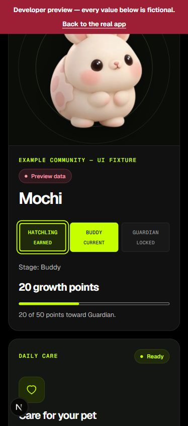
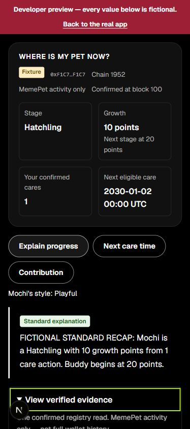
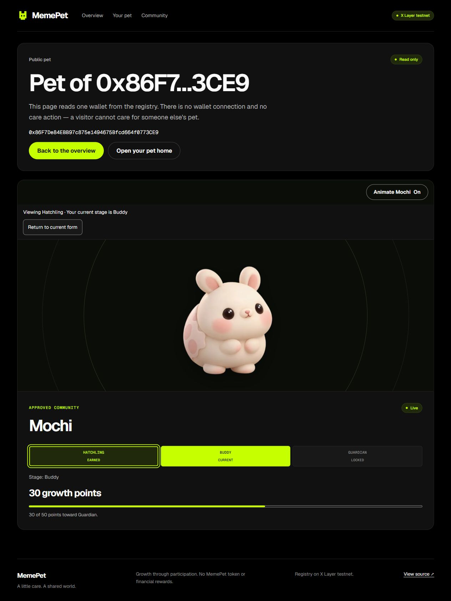

# Combined F5/F6 release — 2 October 2026 (Singapore)

## Reviewed source and release

- Kym #73: `4f3bf148a18f8e9557231b43f600aafec6ac9050`; merged as
  `90849182db3e54a4dc5232193514b15eba4efccd`.
- YeeWei #75: `45ef6f1ce99c1dd6a442459bafcdc104fc75751b`; merged as
  **`d0fc02057eb9d06350c598220a62c68960cd8ab2`** (combined product source).
- Main already included #74's owner/chain/registry scene keys. Independent
  reviews found no additional source blockers in either incoming PR.
- Local integration `e4f0125` combined both heads with `a608a38`; its tracked
  tree matched the resulting `d0fc020` main tree (`git diff --stat` was empty).
- Exact-head PR checks 36884327882 and 36893508127 passed. Combined main
  [CI 36896050843](https://github.com/Chi944/MemePet/actions/runs/36896050843)
  passed, including App, Contracts, helpers, build and production preview gates.
- GitHub/Vercel Production deployment **6790243257** for `d0fc020` reports
  success at `2026-10-01T16:59:52Z` (2 October in Singapore).
  Prior successful product release `a608a38` is retained for rollback through
  the existing deployment process. No release settings changed.

## Local checks actually executed by the lead

| Command | Result |
|---|---|
| `npm test` | 379 tests / 38 files passed |
| `npm run typecheck` | Passed |
| `npm run lint` | Passed; one existing ShareImage native-img warning |
| `npm run build` | Passed with explicit public X Layer testnet configuration |
| `node --test docs/qa/counter-check.regression.mjs docs/qa/rpc-recovery.regression.mjs` | 22 passed |
| `npm run test:contracts` | 15 passed |
| `git diff --check` | Passed |

The eight route reconciliation tests and Kym's real-component tests cover the
remount boundary and form behavior separately. They do not substitute for a
human-approved wallet account/network switch on the combined release.

## Actual local browser checks — fixture evidence only

Codex in-app browser, loopback development server on port 3463:

- `/dev/pet`: at 390px, Enter selected earned Hatchling for Buddy while
  authoritative Buddy/20 points/20-of-50 and disabled Guardian stayed unchanged.
  Return restored Buddy and focused its Current control.
- At 320px, Space selected earned Buddy for Guardian while the actual 50 points
  and final-stage message remained. Changing the supplied fixture back to Buddy
  reset the viewing notice to Current form and restored the supplied artwork.
- Missing artwork kept its placeholder and honest unavailable notice.
- Measured document content/client widths matched: 375/375 at viewport 390,
  305/305 at viewport 320, 1425/1425 at viewport 1440 (scrollbars account for the
  difference). No page horizontal overflow in those inspected states.
- `/dev/companion`: Standard answer plus long fictional addresses at 390px.
  Enter opened and Space closed evidence while focus stayed on the summary.
  The lime outline was visibly inside the summary rather than over its text.
  Computed offset was negative (`-3.63636px` at this browser's effective scaling),
  and content/client widths matched at 375px. The source CSS uses `-4px`.
- Initial Playwright selection timed out during development startup; the
  documented accessible fixture control then worked. This was not recorded as
  a product failure or a passed first attempt.

Temporary viewport overrides were reset, agent-created tabs closed and the
development server stopped before the production build. No OS motion preference
was changed. These observations do not establish dedicated animation playback,
screen-reader or cross-browser acceptance.

## Actual production browser checks — read only

After the successful `d0fc020` deployment, the public route
`https://memepet.vercel.app/pet/0x86F7De84EBB97c875e1494675Bfcd664f0773CE9`
showed **Buddy / 30 growth points / 30 of 50**, Live and Read only. Enter on
Hatchling Earned changed the artwork/description and viewing notice; actual
stage/growth/target stayed unchanged and Guardian remained locked. Return
restored Buddy and focused Buddy Current. No wallet connection or care control
exists on that public page.

The existing Chrome `/pet` tab was connected to Account 3,
`0xb7E6D789c39D468CfE3c5dA37C29Bd9852247B3a`, chain 1952.

1. Before reload, its older runtime showed Buddy/30 points and an Unknown
   community read. The exact pre-refresh runtime revision was not established.
   Clicking **Retry community total** genuinely recovered **11** and **9 more**
   without a wallet prompt. Preserve the initial failure; this is read recovery.
2. After reload onto the released UI, the gallery controls appeared. Pet and
   recap showed Buddy/30 points, 3 personal cares and future next-care time
   `2026-10-02T00:00:00.000Z`. The fresh community read was **12**, with **8 more**.
   These separate read results are not a claim about who caused an increment.
3. Clicking **Contribution** produced a **Standard explanation** reporting
   3 personal cares and community 12. Enter opened full evidence: source block
   **42415259**, source timestamp `2026-10-01T17:01:36.000Z`, observed at
   `2026-10-01T17:01:38.058Z`, configured registry
   `0xe844152262D243a7B90F6e07FF7A67F1d7FeD216` and the same account.
4. Enter on earned Hatchling changed only the viewed form. The actual Buddy,
   30 points and Done today care state remained. Return restored Buddy and
   current-control focus. The user's Chrome tab was left open.

No adoption, care, signature, account switch, network switch or disconnect was
performed. Existing public/connected state and Retry are genuine browser reads;
they are not proof of a new confirmed transaction or automatic receipt read-back.

## Remaining acceptance

- One planned genuine final-release wallet session, with private user approvals:
  rejection, adoption/care where appropriate, automatic pet/community read-back,
  reload, account/network isolation and disconnect. Unperformed rows stay NOT RUN.
- Teammates' combined sign-off at the named release, including remaining motion,
  zoom/assistive-tech or browser checks where available. Do not relabel this
  focused lead pass as the entire F7 checklist.
- Record a real backup labelled with its capture date; then a timed three-minute
  rehearsal. A shot list is not footage.
- Optional OKX.AI listing/invocation remains unverified and outside the completion
  gate for the working-product scope. No new model or paid service was enabled.

The subsequent handoff PR changes documentation/evidence only and records its
own final CI/deployment. Its product source is the verified `d0fc020` tree above.
