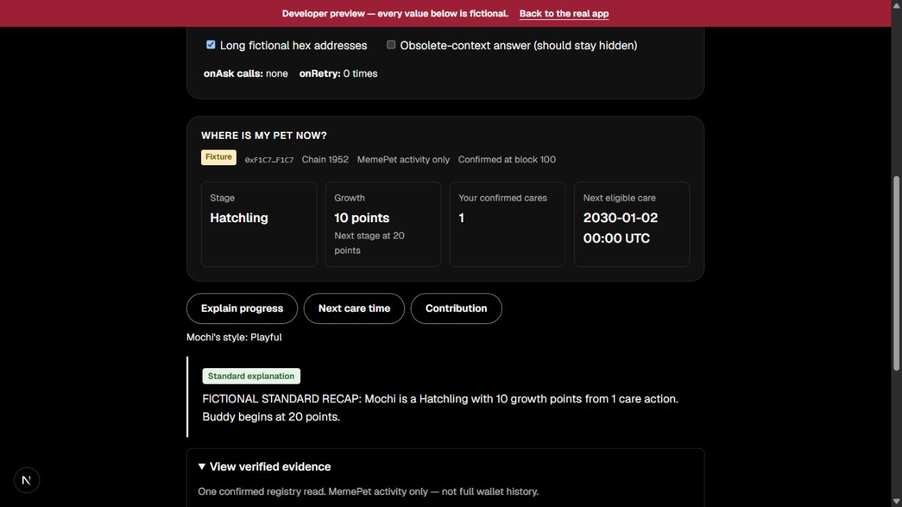

# F6 integration review — 1 October 2026

Lead review of YeeWei's PR [#72](https://github.com/Chi944/MemePet/pull/72),
original head `9cb8b6bdf3d02f8be6552ef1fec7fff20ca55818`, based on
`d279344200cf9320db55cf5edbccafdef1f1059a`. This record accompanies the lead
correction commit. The PR records final exact-head CI and release results.
YeeWei's original observations remain unchanged in her F6 handoff.

## Corrections verified

- A snapshot whose next-care time is at or before its block timestamp says
  **Care at this read: Available**, with **Check Daily care for current status**.
  Future eligibility still shows the supplied UTC date/time. Neither conclusion
  uses the browser clock, and the full evidence retains the original timestamp.
- At a 600px Chrome viewport, the original recap date needed 106px inside a
  93px content box. Increasing the normal minimum card width to 9rem gives the
  date 136px with no horizontal text overflow. The phone layout retains 7rem.
- Independent code review found no remaining source blocker after these fixes.
  All evidence fields, callback IDs, safe text rendering and reply-context
  protection are preserved. No wallet, API or persistence behavior changed.

## Executed checks

| Check | Actual result |
|---|---|
| Companion tests | 27 passed, including two browser-clock/source-time regressions |
| Full app tests | 360 passed across 37 files |
| Typecheck | Passed |
| Lint | Passed; one existing share-image `img` warning |
| Production build | Passed with public X Layer testnet configuration |
| Contracts | 15 passed |
| Counter/recovery helper regressions | 8 + 14 passed |
| Chrome layout | 320, 390, 600 and 1440px checked using rendered DOM dimensions; no page or recap-value horizontal overflow after the correction |
| Chrome keyboard | Enter opens and Space closes the focused native evidence disclosure |
| In-app browser visual | Observed labelled fixture recap, questions, Standard answer and expanded evidence; screenshot below |

The local development preview was `/dev/companion` on port 3462, with the
Standard-answer and long fictional-hex-address scenarios selected. It was
stopped after verification. Temporary browser tabs were closed and the Chrome
viewport override was reset. No device motion preference was changed.

## Limits

- Chrome screenshot capture timed out twice, including after resetting its
  viewport. Chrome DOM/keyboard observations above are not a fresh visual pass.
  The saved visual is from the in-app browser and is explicitly fixture data.
- These observations are not a wallet walkthrough, a new transaction or proof
  of production chain state. No adoption, care, signature or network switch was
  performed in this review. Final integrated wallet acceptance remains NOT RUN.
- Production preview-route gates and the release are checked by exact-head CI
  and the deployment follow-up in PR #72; a local production server was not run
  during this review.
