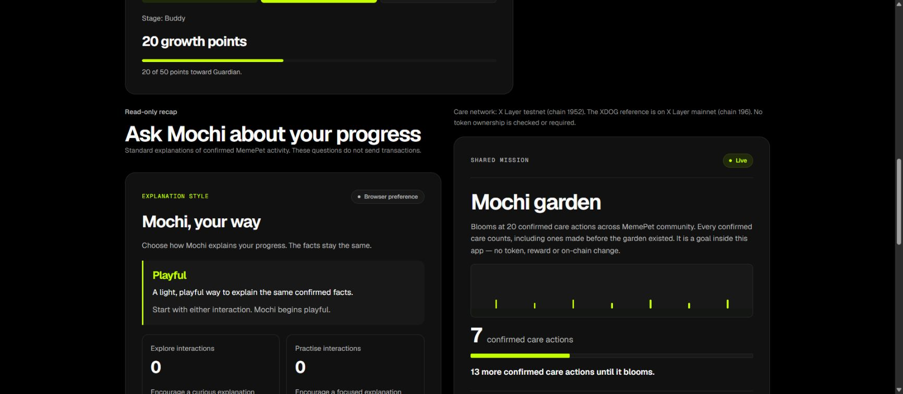

# Personality integration — 1 October 2026 (Singapore)

Base `d79df25`: reviewed Kym #67 and Larm #66 merged. Branch
`feat/finale-personality-integration` adds live wiring and updated team handoffs.

## Behavior

- One `useCompanion` instance supplies both personality and recap. The panel is
  offered for a confirmed adopted pet on the correct network while not writing.
- Explore/Practise and reset use versioned browser-local preferences scoped to
  wallet/chain/registry. Confirmed progress and cooldown remain chain facts.
- An existing Standard answer is rephrased from its same snapshot when style
  changes. This performs no extra API/RPC read or wallet action.
- Storage errors stay explicit; no model training or OKX.AI invocation is claimed.

## Automated/local checks

| Command/check | Result |
|---|---|
| `npm run typecheck` | PASS |
| `npm run lint` | PASS; existing ShareImage img warning, no errors |
| `npm test` | PASS, 343 tests in 37 files |
| `npm run test:contracts` | PASS, 15 tests |
| `node --test docs/qa/counter-check.regression.mjs` | PASS, 8 checks |
| `npm run build` | PASS with explicit public X Layer testnet configuration |
| Local production `/`, `/pet` | 200 |
| Local production `/dev/pet`, `/dev/landing`, `/dev/community`, `/dev/finale`, `/dev/companion` | 404 |

The route suite's 8 tests include saved-profile remount, A–B–A wallet isolation,
Explore/Practise/style/reset, immediate answer rewording with identical evidence,
unchanged care/growth and hidden controls during writes/network mismatch or
disconnect. The first observed run was green because implementation and tests
were written concurrently; an isolated red run is not claimed. API/RPC/wallet
boundaries in this suite are mocks, not genuine wallet interactions.

## Hosted release and real browser checks

PR #68 merged as `3cd4b0a66103a0b7408af7048d960128019950b4`. Production
deployment `6767546180` succeeded at **30 September 18:52:31 UTC** (1 October
02:52:31 Singapore). Exact-head PR CI `36761402881` and merged-main CI
`36761613158` passed. The production alias visibly served the new panel after
navigation/reload; the commit mapping comes from deployment metadata, not a
public runtime SHA banner. Hosted `/` and `/pet` returned 200 and all five
development routes returned 404.

Chrome on `https://memepet.vercel.app/pet`, existing connected Account 2
`0x86F7De84EBB97c875e1494675Bfcd664f0773CE9`, chain 1952:

- Initial profile Playful, Explore 0 / Practise 0. Pet Buddy, 20 points, two
  confirmed cares and community total 7.
- Explain progress returned a labelled Standard explanation at block **42335541**
  (30 September 18:52:58 UTC). Explore changed the style to Curious and reworded
  that already-open answer while keeping its block and facts unchanged.
- Reload retained Curious and Explore 1 / Practise 0. The fresh snapshot used
  block **42335564** (18:53:21 UTC), observed at 18:53:25 UTC.
- Practise once balanced the counts and selected Playful; a second selected
  Focused. Explain progress used the focused introduction with the same facts.
- Reset restored the initial zero counts and Playful, immediately rewording the
  open answer. Care remained Done today, 20 points, next eligible at
  1 October 00:00 UTC; community stayed 7. No wallet prompt was requested.
- A 390px viewport measurement found no horizontal overflow (document width
  375px). Its screenshot timed out, so a full mobile visual pass is **not claimed**.
  The override was reset; desktop screenshot capture succeeded. Kym's separate
  labelled preview evidence remains in `src/components/pet/qa/F2-HANDOFF.md`.

No adoption, care, signature, account switch or network switch was performed for
this change. Wallet isolation was tested automatically, not by a new real wallet
switch. Earlier automatic-read failures and pending final wallet acceptance
remain in their original dated records. The page was left connected as found,
with the original zero-count personality and Animate Mochi On; Windows settings
were unchanged. No normal-motion playback claim is added by this check.
