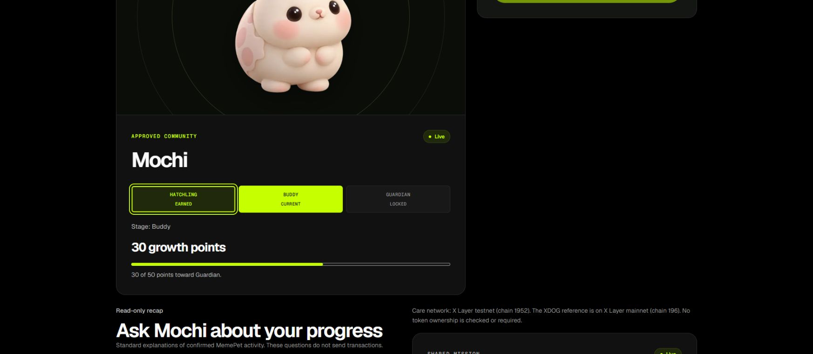
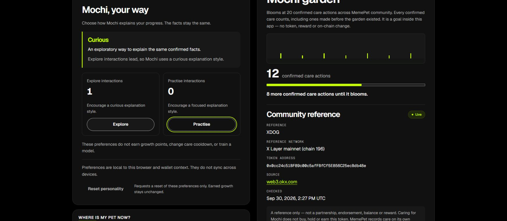

# Pet QA release and final-wallet preflight — 2 October 2026 (Singapore)

## Exact source and release

- Kym's [PR #78](https://github.com/Chi944/MemePet/pull/78) was reviewed at
  `acff137aab4ea618c12946a464ed41e6a73e9916` and merged as
  **`62d487d5d4e1f7c7b26332753f042fcb91a748d8`**.
- The only source change is three preview-control CSS declarations containing
  native selects at 320px. The controls are used by PetPreview; this does not
  change live wallet, care, gallery or recap behavior. Dated evidence and nine
  viewport excerpts accompany the fix.
- Kym's own [report](../../../src/components/pet/qa/PET_RELEASE_QA_2026-10-02.md)
  records 38 pet tests / 5 files, typecheck and lint passing. These are cited
  teammate results, not a claim that the lead reran them locally.
- Exact-head [CI 36921931673](https://github.com/Chi944/MemePet/actions/runs/36921931673)
  and merged-main [CI 36923513503](https://github.com/Chi944/MemePet/actions/runs/36923513503)
  passed. Main CI includes app/contract/helper checks, build and production
  development-route gates. The broader local suite is recorded in the
  [earlier combined run](COMBINED_RELEASE_2026-10-02.md).
- GitHub Production deployment **6794766512** succeeded at
  `2026-10-01T20:42:40Z`. Vercel's deployment API independently resolved the
  `memepet.vercel.app` alias to **dpl_28SRHMBY4m1ojxe8c5zCRpwEXriG**,
  URL `memepet-lx4699ahj-chi944s-projects.vercel.app`, READY/production,
  with `githubCommitSha` equal to the merged SHA above. This is time-bound
  alias evidence, not a permanent assertion about a mutable URL.
- Previous verified product `d0fc02057eb9d06350c598220a62c68960cd8ab2`,
  deployment 6790243257, remains the rollback reference through the existing
  deployment process. No release settings changed.

## Lead browser check — production, read only

Chrome on Windows, existing MemePet tab, `https://memepet.vercel.app/pet`.
After the successful deployment, a normal reload and settled reads recovered
the already-connected Account 3,
`0xb7E6D789c39D468CfE3c5dA37C29Bd9852247B3a`, on chain 1952.
The brief initial hydration state is not evidence of a missing wallet.

The recap identified registry `0xe844152262D243a7B90F6e07FF7A67F1d7FeD216`,
block **42428594**, block time `2026-10-01T20:43:51.000Z`, observed at
`2026-10-01T20:43:53.620Z`. Real state was Buddy / 30 growth points / 3 personal
cares, next-stage target 50, next care `2026-10-02T00:00:00.000Z`, community 12
and 8 remaining to the garden goal.

| Performed action | Observed result |
|---|---|
| Explain progress; keyboard-open verified evidence | Standard explanation reported 3 cares, 30 points, Buddy and the 50-point next stage, with the same block/time. |
| Explore once, using Enter | Playful/0/0 became Curious/1/0. The answer wording changed while factual values and source block stayed unchanged. |
| Select earned Hatchling, using Enter | Earlier art and its viewing notice appeared; actual Buddy/30 points/30-of-50, locked Guardian and disabled Done today care remained. |
| Keyboard focus through personality controls | Practise displayed a visible focus ring; focus alone did not increment its count. |
| Reset personality; Return to current form | Playful/0/0 and current Buddy were restored. The recap facts, cooldown and community total remained unchanged. |

This closes the **read-only same-page** gallery/personality/recap/care-state
coverage gap from Kym's report for the observed state. It does not establish a
new care, automatic receipt read-back, storage isolation across wallet accounts,
network transitions or dedicated animation playback. Kym's original NOT RUN rows
remain her accurate historical record.

These are genuine viewport excerpts, not full-page composites or continuous
transaction footage. The attempted full-page capture timed out; viewport
capture succeeded. Evidence outside these excerpts was inspected in the browser
DOM and is described above. No viewport or OS preference was changed.

## Public read-only wallet preflight

Observed `2026-10-01T20:43:18.767Z`, using public RPC chain 1952 and pinned block
**42428557**, time `2026-10-01T20:43:14.000Z`. Four POST reads to the deployed
`/api/companion` with each address and that block returned HTTP 200, the expected
owner/network/registry, and community total 12. Public balance reads at the same
block found nonzero testnet gas in all four accounts. No credentials were used.

| Account | Public address | Pet / points | Confirmed personal cares | Next care at this read |
|---|---|---|---:|---|
| 1 | `0x3876722934FF2D3dC998656864BD5E8BBe1D5774` | Buddy / 30 | 3 | 2 October 00:00 UTC |
| 2 | `0x86F7De84EBB97c875e1494675Bfcd664f0773CE9` | Buddy / 30 | 3 | 2 October 00:00 UTC |
| 3 | `0xb7E6D789c39D468CfE3c5dA37C29Bd9852247B3a` | Buddy / 30 | 3 | 2 October 00:00 UTC |
| 4 | `0x0A9312A3943A371e8fcA64E8a41769E4766203e6` | Hatchling / 10 | 1 | 2 October 00:00 UTC |

Account 4 already owns a pet; it is **not a fresh adoption account**. After
08:00 Singapore on 2 October, one genuine care may cover both automatic updates
and the Hatchling-to-Buddy transition. Recheck live eligibility/state immediately
before testing; these values can change. Reads do not prove access to a wallet,
who performed its earlier actions, or any new transaction.

The machine-local raw public response is retained as
`C:\Users\User\AppData\Local\Temp\memepet-final-wallet-preflight-2026-10-02.json`.
It is a supplementary local trace, not a durable repository attachment; this
table records the inspected fields. No balance funding was needed or performed.

## Remaining acceptance and handoff

- **NOT RUN on this release:** a new signed care/receipt, automatic pet/community
  and recap read-back, genuine account/network transitions, final disconnect
  persistence and a new dated continuous backup. A successful read is not a
  transaction pass.
- Follow the [final session plan](../FINAL_WALLET_SESSION.md), consolidating
  private user approvals into one session once care is due. September adoption
  and rejection evidence remains historical; no repeat is required merely to
  replace a date on the report.
- Larm incorporates the cited pet report and these lead observations into his
  own combined checklist/runbook. YeeWei completes her companion acceptance.
  Kym's assigned PR is complete; any reproduced pet regression returns to her
  as a focused follow-up. Dedicated motion and other unrun browser cases remain
  explicit until exercised.
- Approved feature scope is complete. Freeze follows actual acceptance;
  backup and rehearsal are separate deliverables. No new feature, paid
  integration, autonomous signature or wallet transaction was added by this run.

The follow-up handoff changes docs/evidence only. Its own PR records final CI;
this document's production browser observations belong to the exact source above.
