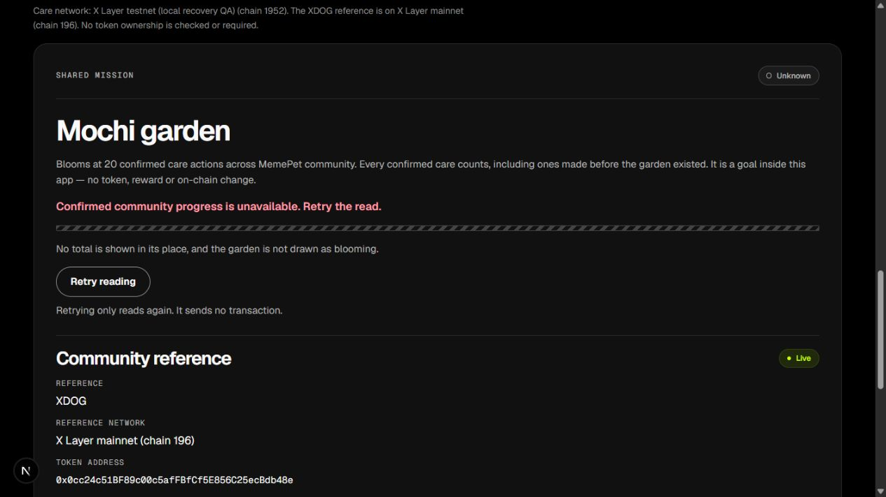
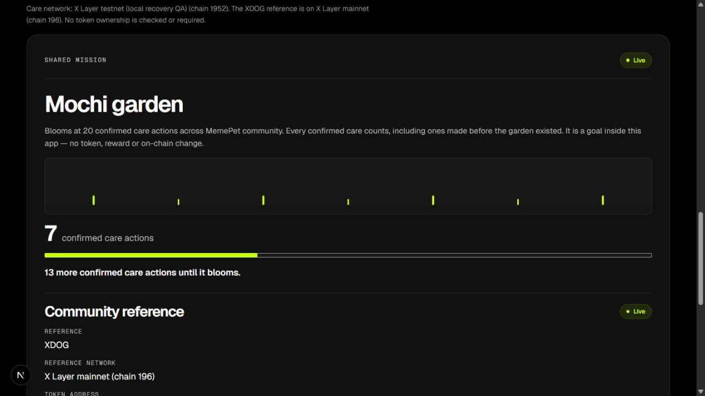

# F7 controlled read recovery — 1 October 2026

Executed by Codex, approximately **13:28–13:36 UTC**, using the Codex in-app
browser at **1280 × 720**. Source base: `9fa64381b47f5279253edf991e2ec86adf47a195`
(merged Larm PR #70), plus the uncommitted changes published with this evidence.
Node 24.19.0, npm 11.19.0, Next.js development server at
`http://127.0.0.1:3462/`; local read-only proxy at `127.0.0.1:18952/rpc`.
This was not the hosted production runtime.

The [reproducible setup](../READ_RECOVERY.md) uses the real public testnet RPC,
chain **1952**, registry `0xe844152262D243a7B90F6e07FF7A67F1d7FeD216`.
No browser wallet was connected, no transaction, signature or wallet-network-
switch request was issued, and no OS preference or saved deployment setting was
changed. Public RPC requests were performed as described below.

## Actual observations

| Action | Observed result |
|---|---|
| Load Overview while proxy deliberately returns HTTP 503 | After the initial read attempts: Unknown, unavailable copy, no numeric total, no blooming garden, and Retry reading. |
| Restore fixed real upstream; click Retry reading without reloading | Live, **7 confirmed care actions**, **13 remaining**. No wallet prompt. |
| Put proxy back into failure mode and reload | Unknown/unavailable returned; the earlier 7 was not presented as a newly confirmed result or replaced with zero. |
| Restore upstream and click Retry reading again | Live 7/13 returned without another reload. |
| Restart the repaired proxy and repeat failure → Retry recovery | Same unavailable → Live 7/13 result on the final tool version. |
| Independent counter helper against public RPC | Block **42402667**, `2026-10-01T13:31:44.000Z`, `communityStats(1) = 7`. This is a separate reading, not an asserted browser snapshot block. |
| Local recap API while final proxy is in failure mode | HTTP **503**, facts and reply explicitly unavailable, never a no-pet result. |
| Local recap API after restoring upstream | HTTP **200** at observation `2026-10-01T13:35:35.888Z`, Account 3, Buddy, 20 points, 2 cares, total 7. Source block **42402895**, hash `0x3b48c9321e833137e9a03b09280bf893666d8d0eaeaffd047f5cc09b8da3cbd4`, timestamp `2026-10-01T13:35:32.000Z`. |

The recovered Standard next-care answer says **“Care was available as of block
42402895”**, names that source time and directs the person to the live Care
panel. It no longer presents an already-eligible snapshot time as a new future
deadline. No care was submitted to check eligibility.

The first attempt at the recap API returned unavailable even in recovery mode:
the new proxy incorrectly required a `params` array on parameterless viem RPC
calls. The local tool was repaired to accept omitted parameters, with a new
regression preserving rejection of explicit invalid parameters. The relay was
restarted before the final successful API and browser checks. This was a test
tool defect; no production RPC settings were changed to work around it.

## Automated checks and boundaries

- `npm test`: **347 tests / 37 files passed**.
- `npm run test:contracts`: **15 passed**.
- Counter helper regressions: **8 passed**.
- Recovery proxy regressions: **14 passed**, mocked upstream only. Covers
  parameterless viem reads, fail/recover modes, atomic write-batch rejection,
  Host/origin/method/body limits, deadlines, concurrency and cleanup.
- Typecheck and lint passed; one pre-existing `ShareImage.tsx` image warning.
- Production build passed using explicit public testnet settings, not the local
  recovery overrides. Local production-server startup was blocked by automatic
  approval review (only reason supplied: "blocked by policy"), so local
  production route gates were **NOT RUN**. The existing CI gate remains required.
- An independent code review found no actionable blocker; the later optional
  params repair was covered by the additional regression and actual API retest.

The temporary tab and both local processes were closed. No local fault proxy is
deployed or left running. CI and release results are recorded in this PR and
the release follow-up; they remain separate from the local browser test.

**NOT RUN:** fresh production wallet rejection/adoption/care, automatic pet and
community reads after a newly confirmed care, account/network switching,
later-day evolution, combined F5/F6 regression, projector rehearsal or backup
capture. Kym F5 and YeeWei F6 have not started, per Deston. The garden remains
below its goal; no bloom or new community activity is claimed.
