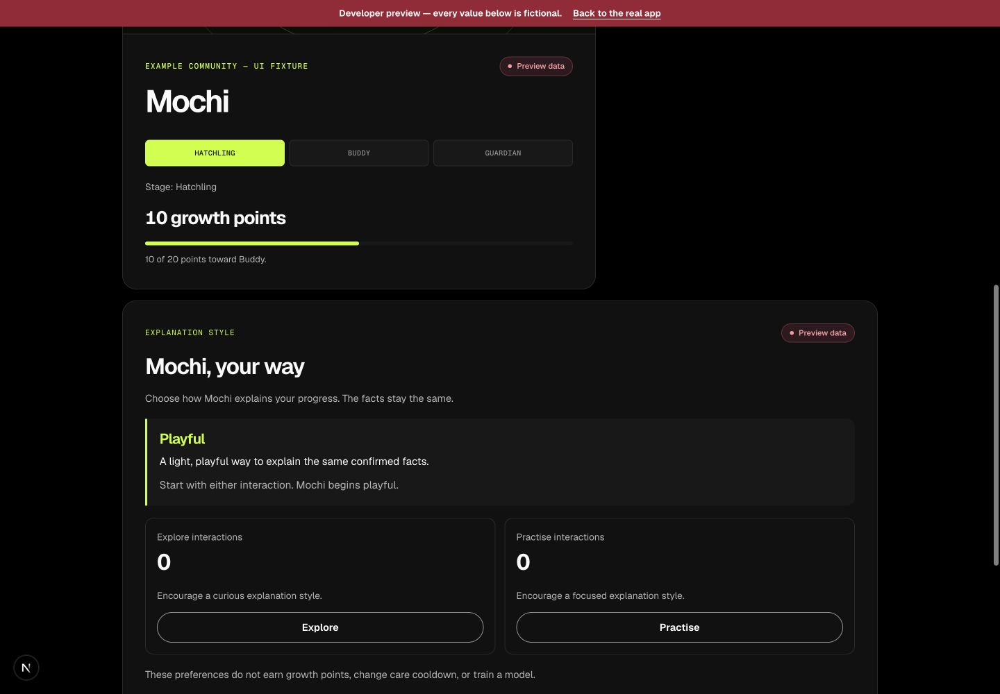
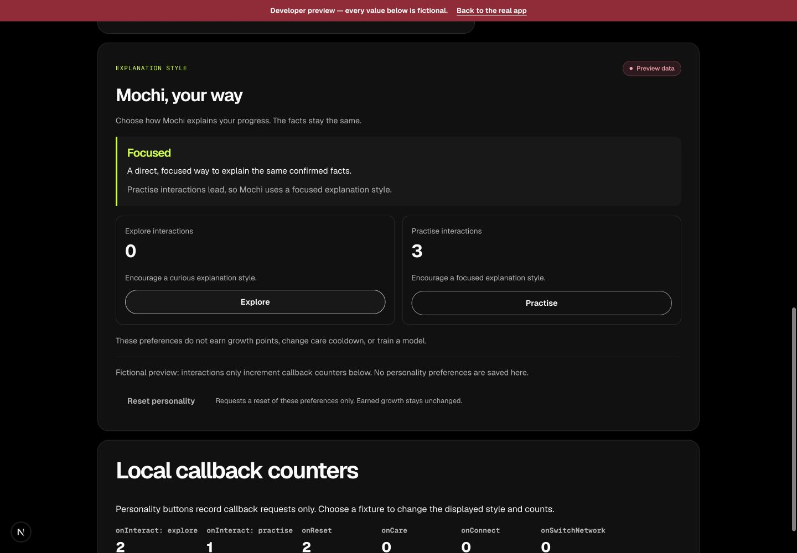
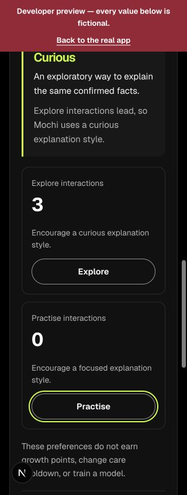
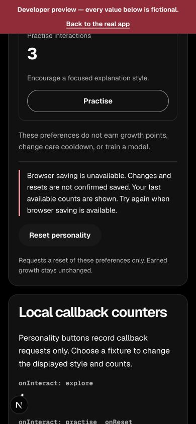

# F2 personality panel handoff — 1 October 2026

Branch: `feat/finale-pet`. Base: `abc01948b28719d954850ce671cd1fec7360a9a1`.
Draft PR: https://github.com/Chi944/MemePet/pull/67.

## Delivered

`PersonalityPanel` consumes the existing `PersonalityPanelProps`. It renders the
supplied style and counts, explains the style, and calls `onInteract("explore")`,
`onInteract("practise")` and `onReset()` only. It has no profile state, storage,
RPC/model calls or care callback. No optimistic counts or saved-success messages.
Saving availability and profile updates remain the parent's responsibility.
Live preferences are labelled **Browser preference**, never chain-backed Live.
Fixture data and saving failures have explicit notices.

`PetPreview` uses the existing three `personalityFixtures` and a separate saving-
unavailable toggle. Its personality callbacks increment local request counters
only. Selecting a fixture is the only way to change its displayed profile; this
preview does not claim to simulate persistence or personality progression.
Existing PetScene/CarePanel exports, stage art, growth and motion controls are
unchanged. No artwork was generated or modified, so provenance is unchanged.

## Actual checks

Node 24.19.0, npm 11.19.0:

- `npm run typecheck`: passed.
- `npm run lint`: passed with the pre-existing native-img warning in
  `src/components/share/ShareImage.tsx`; no new warnings.
- `npm test`: passed, 341 tests / 37 files (10 new F2 tests).
- `npm run build`: passed.
- `node --test docs/qa/counter-check.regression.mjs`: passed, 8 tests.
- Local contract tests: not run; this change does not edit contracts.

Initial typecheck and build failed because new Testing Library queries included
an unsupported `exact` option. Removing that option retained default exact-name
matching; the subsequent checks above passed. No assertions or checks disabled.

## Browser observations

Local `/dev/pet`, fictional inputs, in the Codex browser:

- Measured `scrollWidth === clientWidth` at 320, 390 and 1440 pixels.
- Default playful, curious (3 Explore), focused (3 Practise), and saving-
  unavailable states rendered their supplied wording and counts.
- At 390px, Enter activated Explore once; Tab reached Practise, Space activated
  it once; Tab reached Reset, Enter activated it once. Counters became 1/1/1
  while care stayed 0 and the displayed profile/growth stayed unchanged.
- The keyboard focus outline was visible. Narrow interaction cards stack;
  desktop cards sit side by side. Text and saving failure remain readable.
- Animate Mochi Off disabled the greeting button; computed artwork animation
  and transform were `none`, and artwork remained visible. Restored On afterward.
- The browser's effective `prefers-reduced-motion` value was **false**. OS-level
  reduced-motion playback was **not run**. The new panel introduces no animation,
  and its reduce rule removes button transitions; this code check is not an
  observed reduced-motion pass. Existing normal Mochi animation was not watched
  as a dedicated playback test. No OS settings were changed.
- A full-page clipped capture produced an artifact and was discarded. Screenshots
  below are ordinary viewport captures, not stitched full-page evidence.

## Viewing steps and lead integration

Run `npm run dev` and open `/dev/pet`. Choose each Personality fixture and toggle
Browser saving unavailable. Try Explore, Practise and Reset; inspect the callback
counters. Switch stage/care independently to verify these inputs remain separate.

No shared inputs are missing. Import `PersonalityPanel` from
`src/components/pet/PersonalityPanel` and pass `personality` from the **existing**
`useCompanion` instance in the wallet route. Do not create another store. The lead
controls availability and verifies saved-profile updates, reset/account isolation,
explanation wording, and unchanged chain growth/cooldown after integration.
These live/persistence checks were not performed by the fictional preview.

Kym's session has not merged or deployed this work; review, conflicts, route
integration, merge and release belong to the lead.
