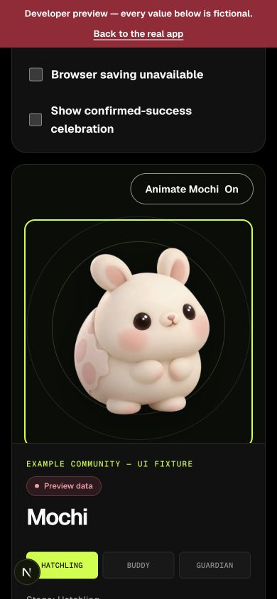
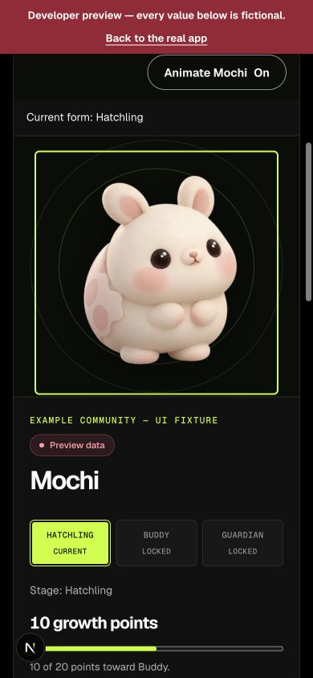
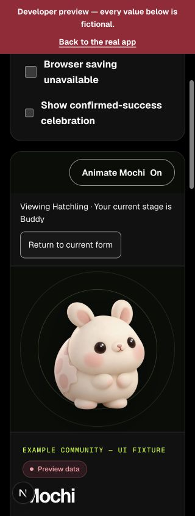
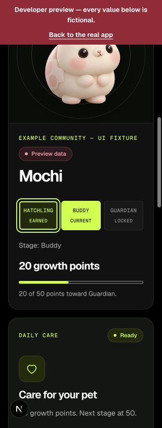
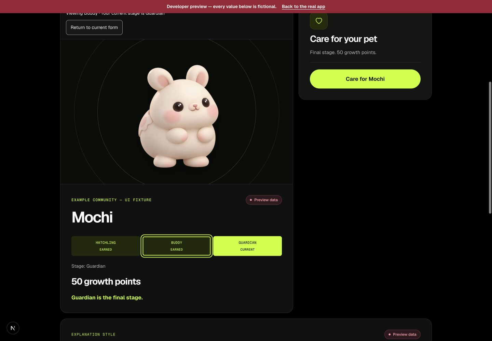
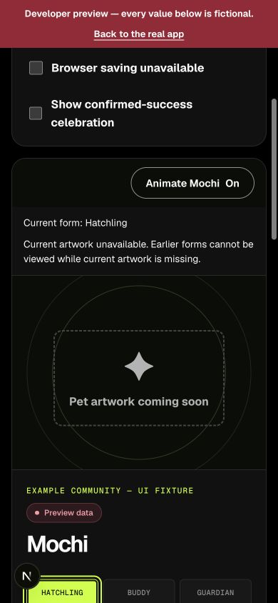

# F5 earned-form viewer — 1 October 2026

Branch: `feat/earned-stage-viewer`.
Base: `d279344200cf9320db55cf5edbccafdef1f1059a` (current reviewed origin/main).
Draft PR: https://github.com/Chi944/MemePet/pull/73.

## Delivered and scope

Only `src/components/pet/**` changed: PetScene, its CSS, PetScene/PetPreview tests
and this evidence. No F2 rebuild, new artwork, props, routes, hooks, dependencies,
wallet/RPC clients or storage logic. Existing Animate Mochi remains in use.

The growth trail is now native buttons with pressed state and Current/Earned/
Locked labels. Only forms at or before supplied `pet.stage` are selectable;
points do not unlock forms. Earlier forms use the existing approved art and an
accessible description that names both viewed and current stages. Current form
uses the supplied `artSrc`, including custom artwork. The current-stage marker,
points, progress fraction/target, provenance and care inputs remain unchanged.
The notice says which form is viewed; Return to current form restores the supplied
art and moves keyboard focus to the current-stage control.

Selection resets synchronously on supplied stage changes. Missing current art
also clears earlier selection, retains the intentional placeholder and disables
earlier viewing rather than fabricating a current pet. Restoring art starts at
current. Same-stage updates retain selection. No dates, history or streaks added.

## Required lead integration — not implemented here

**Key BOTH live and public PetScene mounts by displayed owner address, deployment
chain ID and registry.** Live owner is the connected wallet; public owner is the
route address. Same-stage account/context changes must remount this component.
Its unchanged props contain no identity, so it cannot detect those changes itself.
A component test verifies React key remount behavior; actual route wiring/account
switches are NOT RUN and remain a lead integration dependency. No missing shared
schema is requested. Lead handles review, conflicts, integration, merge and release.

## Exact checks

Node 24.19.0 / npm 11.19.0:

- `node node_modules/vitest/vitest.mjs run src/components/pet/PetScene.test.tsx src/components/pet/PetPreview.test.tsx`: 23 passed before the final focus assertion; final full suite includes it.
- `npm run typecheck`: passed.
- `npm run lint`: passed, one pre-existing ShareImage native-img warning.
- `npm test`: passed, 358 tests / 37 files, including 11 new F5 cases.
- `npm run build`: passed.
- `node --test docs/qa/counter-check.regression.mjs`: passed, 8 tests.
- `node --test docs/qa/rpc-recovery.regression.mjs`: passed, 14 tests after granting the local-listener access the tests need.
- Local contract tests: NOT RUN; no contract changes. PR CI is reported separately.

The first new component/full-suite run failed because adjacent spans produced
concatenated accessible names. An explicit separator fixed the names; no test
was removed or weakened. The first sandboxed RPC regression run failed 13 tests
with `listen EPERM`; the unchanged suite passed with local-listener access.

## Genuine browser observations

Local `/dev/pet`, labelled fictional data, Codex in-app browser:

- 320, 390 and 1440px: `documentElement.scrollWidth === clientWidth`; no horizontal overflow measured. Earned/current/locked labels and current progress were readable.
- Hatchling offered only current; Buddy allowed earlier Hatchling and kept Guardian disabled. Enter and Space selected earlier art; Tab skipped locked Guardian. Buddy remained 20 points toward 50, and care callbacks stayed untouched.
- Return-to-current originally dropped focus when its button disappeared. It now focuses Buddy Current; this was rechecked in the browser and covered by a test.
- Changing the fixture from Buddy to Guardian reset the view to Guardian. Selecting earned Buddy then retained the actual Guardian label, 50 points and final-stage message.
- The supplied Missing artwork fixture retained its placeholder and honest notice. Missing Buddy/Guardian art and losing art during an earlier selection are covered by component tests, not a new shared browser fixture.
- Animate Mochi Off on earlier Buddy disabled greeting; computed artwork animation/transform were `none` and the image remained visible. Restored On afterward.
- The effective reduced-motion preference was false. OS-level reduced-motion and dedicated normal-animation playback: NOT RUN. The gallery adds no animation; existing reduced-motion rules and narrow Mochi exception remain unchanged. No OS preference changed.
- No wallet connected, no transaction, no live scope-remount verification and no production deployment performed by this task. Viewport overrides were reset afterward.

### Focus ring and empty-track correction

At 390px before editing, the artwork button had a 2px outline and +5px offset,
while its bottom was only 1px inside an overflow-hidden frame. This clipped the
lower outline; direct overlap with switch/stage text was not observed. After
`outline-offset: -4px`, the ring stays inside the button and is visibly complete,
clear of the notice/switch and details. Geometry and screenshots verify this.

Before: track #181818 against card #111111, no border/shadow, contrast about
1.06:1. After: a 1px inset #929292 outline marks the full length at about 6.07:1
against the card. The fill width and aria values remain unchanged (Hatchling
10/20 and Buddy 20/50 observed). These are local computed-colour measurements,
not a physical-projector or forced-colours test.

## Screenshots (viewport excerpts)

## Reproduce

Run `npm run dev`, open `/dev/pet`. Select Buddy, activate Hatchling Earned,
inspect notice/art and unchanged current progress, then return. Select Guardian
and view both earlier forms. Change stage while viewing earlier; verify reset.
Select Missing artwork. Check Tab/Enter/Space and Animate Mochi Off at the three
widths. The preview is fictional and remains production-gated by the lead route.
