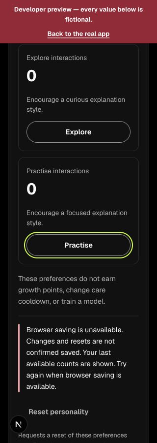
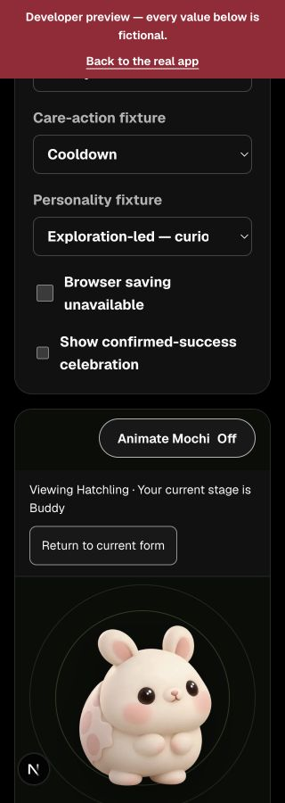
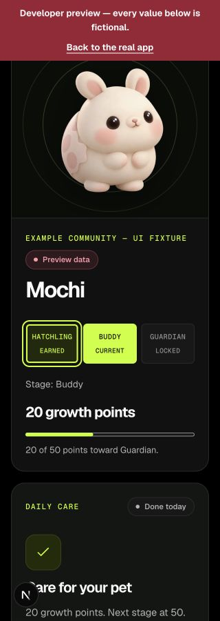
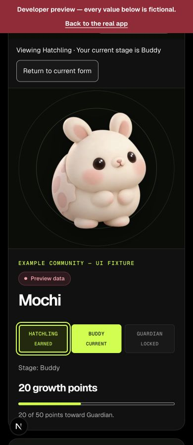
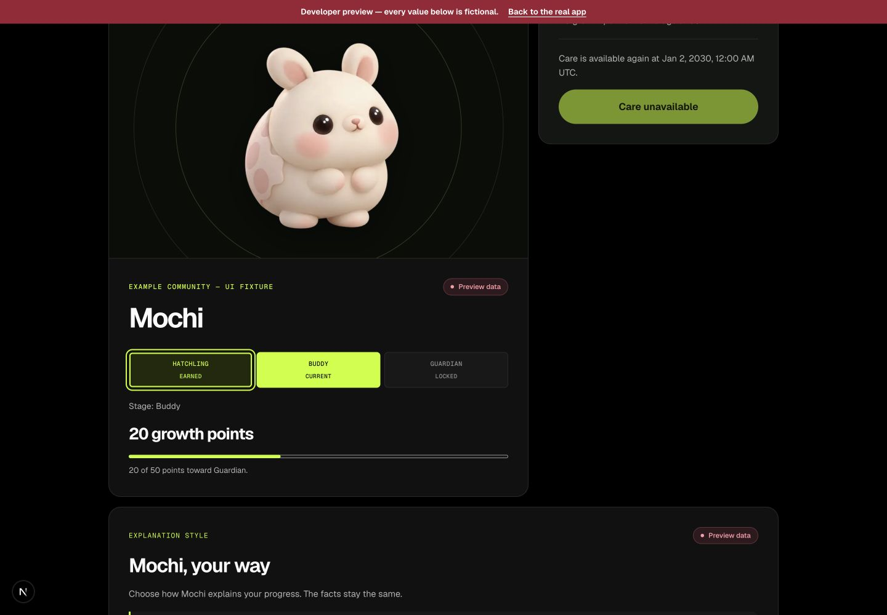
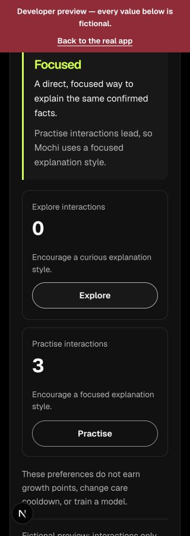
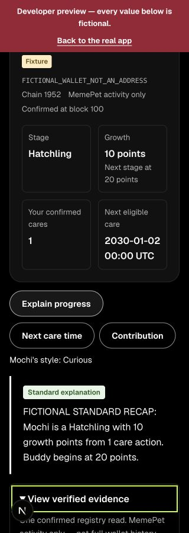
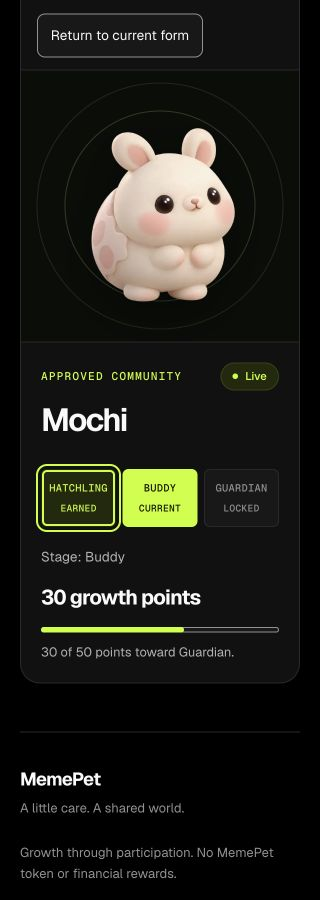
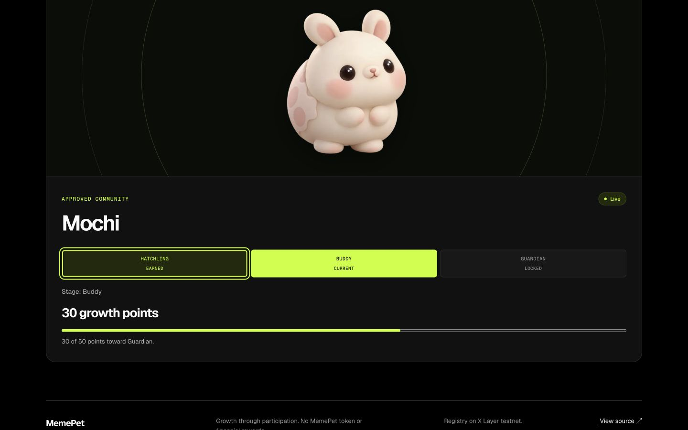

# PET-RELEASE-QA — 2 October 2026

## Identity and scope

- Branch: `test/pet-release-qa`; clean initial checkout, no existing local/remote QA branch or open PR. Fetched origin before branching; merged feature branches were not reused.
- Base: `e425db079f771efb1de3c4bb80b681a00193c135`.
- Checked source head: `50c24bb4e20e981c05c92201242cc09fda842524` (base plus the three CSS declarations described below). Browser checks used this source content before its commit; subsequent changes are this report/screenshots only. Final handoff head is recorded in the PR.
- Run: 2 October 2026, approximately 03:49–04:27 Singapore (01 October 19:49–20:27 UTC); Node 24.19.0, npm 11.19.0, Next.js 16.3.5.
- Browser: Codex in-app browser on macOS. Local runtime `http://127.0.0.1:3000`, started with `npm run dev -- --hostname 127.0.0.1`.
- Only pet CSS and new dated pet QA evidence changed. Original F5 handoff is preserved. No props, progression, assets, dependencies, routes, storage, wallet or RPC logic changed.

## Local fictional previews — personally run

`/dev/pet` explicitly labels fictional values and callback-only interactions. Pet, care and personality are on this same preview. The separate `/dev/companion` recap uses independent fictional inputs; it is not a combined wallet session.

| Check | 320px | 390px | 1440px | Actual observation |
|---|---|---|---|---|
| Earned/current/locked | PASS | PASS | PASS | Hatchling has only current; Buddy permits Hatchling with Guardian disabled; Guardian permits earlier Buddy. |
| Keyboard return | PASS | PASS | PASS | Enter/Space selects earlier form; return restores Buddy and focus to Buddy Current. |
| Stage changes | PASS | PASS | PASS | Changing fixture resets to its current form; Guardian remains actual 50 points while earlier Buddy is viewed. |
| Missing-art fixture | PASS | PASS | PASS | Honest unavailable notice and placeholder, current Hatchling/10-of-20 retained; no invented current image. |
| Actual growth/care | PASS | PASS | PASS | Earlier Hatchling leaves Buddy 20/50, Done today and the supplied 2030 cooldown unchanged. No care callback from gallery browsing. |
| Page width | PASS | PASS | PASS | Measured clientWidth/scrollWidth were 320/320, 390/390 and 1440/1440. This does not imply every internal control fitted before the CSS repair. |

Additional observations:

- At desktop, Tab moved from Hatchling Earned to Buddy Current, then skipped disabled Guardian to Care for Mochi in the Ready fixture. The care button was not activated.
- Explore Enter, Practise Space and Reset Enter each incremented their matching fictional counter once on the first sequence; care/connect/network counters remained zero. Later Explore clicks brought its counter to three, with care still zero. Fixture profile counts did not falsely claim persistence.
- Playful, Curious and Focused fixture text rendered. At 320px the unavailable-saving notice explicitly said changes/resets were not confirmed saved; controls remained usable and text wrapped. The screenshot of Practise focus showed its complete ring.
- Animate Mochi Off at 320px disabled greeting, left earlier artwork visible and yielded computed image animation/transform `none`. Restored On and activated greeting. This verifies the control behavior, not frame-by-frame playback. Effective reduced-motion preference was false. OS preference was not changed; dedicated normal-motion and reduced-motion playback remain NOT RUN.
- Artwork keyboard focus at desktop retained the inset `-4px` outline, with the lower edge visible inside the art frame. No new overlap with the motion switch/stage content was reproduced. The complete empty-track boundary remained visible, with Buddy 20/50 unchanged.
- Separate recap: Standard fixture answer, Curious label, Hatchling 10 points/one care/block 100 remained explicit fiction. At 320px evidence opened with Enter and closed with Space, retaining focus on View verified evidence; no horizontal overflow measured. This does not prove personality-to-recap live wiring.

## Reproduced defect and owned repair

At `/dev/pet`, viewport 320px, the Personality fixture selector's intrinsic width was 266.70px inside a 246px content area. Its right edge was x303.70 versus the intended x283, intruding into the card padding. The document itself still reported no horizontal overflow.

Added `min-width: 0` to preview control labels, and `width: 100%; min-width: 0` to their native selects in `pet.module.css`. All three selects then measured 246px, right edge x283. Native selection still worked. Long selected option text may be clipped by the native select at this width; its full option/name remains available through the control. This is a preview-only layout repair, with no production behavior change. No redundant CSS implementation-mirroring test was added; browser geometry and before/after captures establish the defect and correction.

## Production read-only observations — personally run

URL: `https://memepet.vercel.app/pet/0x86F7De84EBB97c875e1494675Bfcd664f0773CE9`.

**Current hosted revision: UNVERIFIED in this run.** The lead's [2 October combined release evidence](../../../../docs/qa/evidence/COMBINED_RELEASE_2026-10-02.md) links product `d0fc02057eb9d06350c598220a62c68960cd8ab2` to production deployment 6790243257. That is cited historical evidence, not an independent assertion that this mutable alias still serves that SHA.

- Public pet displayed Live and Read only, Buddy / 30 growth points / 30-of-50, with Guardian locked.
- At measured 320, 390 and 1440px, earlier Hatchling selection changed art/notice and retained actual Buddy/30-of-50. Return restored Buddy and focused Buddy Current. Document widths matched at each width.
- No care/connection control exists on this public page. No wallet was connected, prompted or signed. Counts are time-bound observations, not guaranteed demo values.
- Initial new-tab observation used its default 1280px viewport; this was subsequently explicitly resized and verified. Screenshot filenames reflect the later measured widths.

## Commands and actual results

Pinned runtime invoked npm through the installed npm CLI entry point; commands below are the equivalent repo commands. These were rerun after the CSS repair.

| Command | Result |
|---|---|
| `npm test -- src/components/pet` | PASS — 38 tests, 5 files |
| `npm run typecheck` | PASS |
| `npm run lint` | PASS — zero errors, one existing ShareImage native-img warning |
| `git diff --check` | PASS |
| Full app tests/build, Node regressions and local contract tests | NOT RUN locally for this three-declaration preview CSS change; final PR CI reported separately |

Vite printed its existing future-native-config-loader warning; it did not fail the test run. The first recap lookup by button role timed out because the DOM exposed a native summary as generic. Fresh DOM inspection followed by exact visible-text selection worked; this was a tool-locator failure, not a product failure. Full-page screenshot output showed stitching duplication/blank areas, so those captures were replaced with genuine viewport excerpts, not edited into synthetic evidence.

The development server was stopped. Its generated `next-env.d.ts` path changes were inspected and restored to the clean starting version. Temporary viewport overrides were reset and this run's tabs closed. No merge or manual deployment was performed.

## Remaining NOT RUN and handoff to Larm / Codex

- **Combined gallery + recap + personality + care on one live page: NOT RUN.** `/dev/pet` contains gallery/care/personality but no recap; `/dev/companion` is separate; `/dev/finale` is an independent fixture inspector. Public pet has no personality/care/recap. Please include this same-page check in the already-planned lead wallet session; do not infer it from the separate fixture results. No new preview adapter or route is requested by this lane.
- **Final genuine wallet acceptance: NOT RUN** — adoption/care, rejection, receipt read-back, refresh persistence, account/chain/registry scope switching and disconnect belong to the single Codex/Deston session. No wallet prompts initiated here.
- **Hosted commit identity: UNVERIFIED** — lead should attach current alias-to-SHA evidence to final acceptance; successful local tests are not deployment identity.
- **Dedicated animation playback, reduced-motion-device playback, screen reader, zoom, cross-browser and physical-device checks: NOT RUN.** Only in-app browser and its effective non-reduced preference were used; the narrow Mochi exception was preserved unchanged.
- Missing current Buddy/Guardian art was not supplied by this browser fixture; existing component tests cover missing-art transitions. No new shared fixture was invented.
- No new shared-route defect reproduced. Larm can cite this report for pet presentation and the one preview repair, retaining the above blockers. Codex reviews/merges/releases; this lane does not edit shared status or another owner's checklist.

## Screenshots — viewport excerpts, not full-page composites

